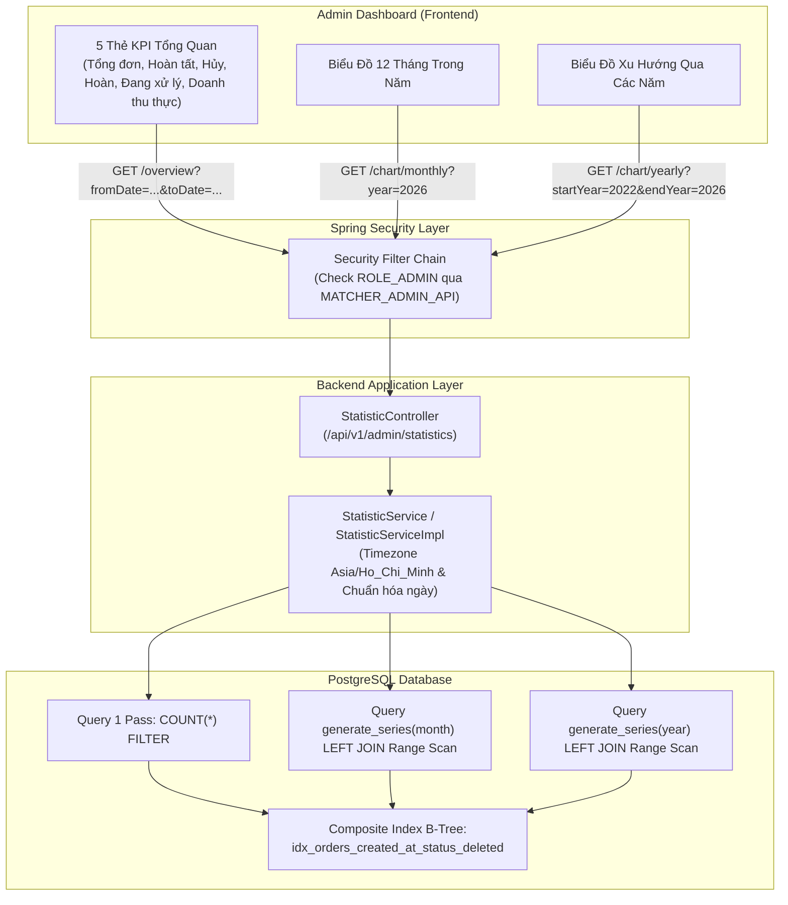

# Kế Hoạch Chi Tiết Triển Khai Thống Kê Doanh Thu & Đơn Hàng (Admin Analytics)

## 1. Mục Tiêu Dự Án (Goal Description)
Xây dựng phân hệ Thống kê & Báo cáo Doanh thu - Đơn hàng cho Admin Dashboard với các yêu cầu kỹ thuật chuẩn chỉnh:
1. **Thẻ KPI Tổng quan (5 Thẻ chỉ số đơn & Doanh thu thuần)**: Lọc linh hoạt theo khoảng thời gian `[fromDate, toDate)`, sử dụng tính năng **`COUNT(*) FILTER (WHERE ...)`** của PostgreSQL để đếm toàn bộ 5 nhóm trạng thái và tính doanh thu thuần (đã trừ phí vận chuyển) của **duy nhất các đơn đã hoàn tất (`COMPLETED`)** chỉ trong **1 lượt quét bảng duy nhất**.
2. **Biểu đồ Doanh thu theo Tháng (Monthly Chart)**: Tận dụng **`generate_series`** để tự động sinh đủ 12 tháng (Zero-filling ngay trong database), kết hợp **Index Range Scan** trên cột `created_at` để vẽ biểu đồ doanh thu và số lượng đơn hàng `COMPLETED` liên tục không bị khuyết tháng.
3. **Biểu đồ Doanh thu theo Năm (Yearly Chart)**: Thống kê doanh thu qua các năm gần nhất bằng `generate_series(..., interval '1 year')`.
4. **Kiến trúc tinh gọn**: Gọi trực tiếp `StatisticController -> StatisticService -> OrderRepository`, **không dùng tầng Facade**. Phân quyền Admin kiểm soát tập trung qua `OpLearnConstants.AuthConstant` và Spring Security Filter.

---

## 2. Luồng Kiến Trúc Hệ Thống (System Architecture)



---

## 3. Các Điểm Kỹ Thuật Đã Thống Nhất (Technical Consensus)

> [!IMPORTANT]
> **1. Quy tắc Tính Doanh thu Thuần (`revenue`) & Lọc Đơn Hàng:**
> - **Công thức Doanh thu thuần**: `SUM(o.total_amount - o.shipping_fee)`. Trừ `shipping_fee` vì đây là chi phí trả cho đơn vị vận chuyển (GHTK), không thuộc doanh thu của Shop.
> - **Chỉ ghi nhận đơn hoàn tất**: **`status = 'COMPLETED'`**. Đảm bảo doanh thu cầm chắc trong tay 100%, không bị ảnh hưởng bởi đơn bom COD hoặc đơn hủy/hoàn sau đó.
> - **Loại trừ đơn phụ**: `o.original_order_id IS NULL` để tránh tính đúp doanh thu cho các đơn đổi trả/chia đơn.
> - **Soft-Delete**: Bắt buộc có điều kiện `o.is_deleted = false`.

> [!TIP]
> **2. Tối ưu Hiệu năng Database với B-Tree Index Range Scan:**
> - Trong mệnh đề `LEFT JOIN` của `generate_series`, cột `o.created_at` đứng độc lập một bên dấu so sánh `>=` và `<`:
>   ```sql
>   ON o.created_at >= (m.period AT TIME ZONE 'Asia/Ho_Chi_Minh')
>  AND o.created_at < ((m.period + interval '1 month') AT TIME ZONE 'Asia/Ho_Chi_Minh')
>   ```
> - PostgreSQL sử dụng trực tiếp **Composite Index `(created_at, status, is_deleted)`** mà không bị Full Table Scan.

> [!NOTE]
> **3. Bảo mật Phân quyền Tập trung:**
> - Endpoint đặt dưới `/api/v1/admin/statistics/**`.
> - Tận dụng quy tắc có sẵn trong `OpLearnConstants.AuthConstant.MATCHER_ADMIN_API = {"/api/v1/admin/**"}` kết hợp Spring Security Filter tự động chặn người dùng không có `ROLE_ADMIN`. Không cần viết mã kiểm tra quyền thủ công trong Service/Controller.

---

## 4. Chi Tiết Các Thay Đổi (Proposed Changes)

### 4.1 Database & Liquibase
Tạo composite index tối ưu hóa cho bảng `orders`.

#### [NEW] `src/main/resources/db/changelog/030-add-index-orders-created-at.xml`
```xml
<?xml version="1.0" encoding="UTF-8"?>
<databaseChangeLog
  xmlns="http://www.liquibase.org/xml/ns/dbchangelog"
  xmlns:xsi="http://www.w3.org/2001/XMLSchema-instance"
  xsi:schemaLocation="http://www.liquibase.org/xml/ns/dbchangelog
                      http://www.liquibase.org/xml/ns/dbchangelog/dbchangelog-4.0.xsd">

  <changeSet id="030-add-index-orders-created-at-status" author="ecommerce">
    <createIndex tableName="orders" indexName="idx_orders_created_at_status_deleted">
      <column name="created_at"/>
      <column name="status"/>
      <column name="is_deleted"/>
    </createIndex>
  </changeSet>

</databaseChangeLog>
```

#### [MODIFY] `src/main/resources/db/master.xml`
Include changeset mới:
```xml
<include file="db/changelog/030-add-index-orders-created-at.xml"/>
```

---

### 4.2 Lớp DTO & Spring Data Projections

#### [NEW] `src/main/java/org/oplearn/project/dto/response/OrderSummaryProjection.java`
Interface hứng kết quả 5 thẻ số đơn & doanh thu từ query `COUNT(*) FILTER`:
```java
package org.oplearn.project.dto.response;

import java.math.BigDecimal;

public interface OrderSummaryProjection {
  Long getTotalOrders();
  Long getCompletedOrders();
  Long getCancelledOrders();
  Long getRefundedOrders();
  Long getInProgressOrders();
  BigDecimal getTotalRevenue();
}
```

#### [NEW] `src/main/java/org/oplearn/project/dto/response/OrderTimelineProjection.java`
Interface hứng kết quả mốc thời gian từ query `generate_series`:
```java
package org.oplearn.project.dto.response;

import java.math.BigDecimal;
import java.time.LocalDate;

public interface OrderTimelineProjection {
  LocalDate getPeriod();
  BigDecimal getRevenue();
  Long getOrderCount();
}
```

#### [NEW] `src/main/java/org/oplearn/project/dto/response/OrderOverviewStatisticResponse.java`
DTO phản hồi cho thẻ KPI Dashboard:
```java
package org.oplearn.project.dto.response;

import lombok.AllArgsConstructor;
import lombok.Builder;
import lombok.Data;
import lombok.NoArgsConstructor;

import java.math.BigDecimal;
import java.time.Instant;

@Data
@Builder
@NoArgsConstructor
@AllArgsConstructor
public class OrderOverviewStatisticResponse {
  private Instant fromDate;
  private Instant toDate;
  private Long totalOrders;         // Tổng số đơn
  private Long completedOrders;     // Đơn hoàn tất (COMPLETED)
  private Long cancelledOrders;     // Đơn đã hủy (CANCELLED)
  private Long refundedOrders;      // Đơn đã hoàn tiền (REFUNDED)
  private Long inProgressOrders;    // Đơn đang xử lý (PAID, SHIPPING, DELIVERED...)
  private BigDecimal totalRevenue;  // Tổng doanh thu thuần của đơn COMPLETED (đã trừ ship)
}
```

#### [NEW] `src/main/java/org/oplearn/project/dto/response/OrderTimelineStatisticResponse.java`
DTO phản hồi cho từng điểm trên biểu đồ:
```java
package org.oplearn.project.dto.response;

import lombok.AllArgsConstructor;
import lombok.Builder;
import lombok.Data;
import lombok.NoArgsConstructor;

import java.math.BigDecimal;
import java.time.LocalDate;

@Data
@Builder
@NoArgsConstructor
@AllArgsConstructor
public class OrderTimelineStatisticResponse {
  private LocalDate period;         // Mốc thời gian (vd: 2026-05-01)
  private String label;             // Nhãn hiển thị ("Tháng 05/2026" hoặc "Năm 2026")
  private BigDecimal revenue;       // Doanh thu thuần của đơn COMPLETED
  private Long orderCount;          // Số lượng đơn COMPLETED
}
```

---

### 4.3 Lớp Repository (`OrderRepository.java`)

Bổ sung 3 phương thức Native Query tối ưu:

#### [MODIFY] `src/main/java/org/oplearn/project/repository/OrderRepository.java`
```java
  // 1. Query 5 thẻ số đơn & doanh thu đơn COMPLETED (Single-pass scan bằng COUNT(*) FILTER)
  @Query(value = """
      SELECT COUNT(*) AS totalOrders,
             COUNT(*) FILTER (WHERE o.status = 'COMPLETED') AS completedOrders,
             COUNT(*) FILTER (WHERE o.status = 'CANCELLED') AS cancelledOrders,
             COUNT(*) FILTER (WHERE o.status = 'REFUNDED')  AS refundedOrders,
             COUNT(*) FILTER (WHERE o.status NOT IN ('COMPLETED', 'CANCELLED', 'REFUNDED')) AS inProgressOrders,
             COALESCE(SUM(o.total_amount - o.shipping_fee) FILTER (WHERE o.status = 'COMPLETED'), 0) AS totalRevenue
      FROM orders o
      WHERE o.original_order_id IS NULL
        AND o.is_deleted = false
        AND o.created_at >= :fromDate AND o.created_at < :toDate
  """, nativeQuery = true)
  OrderSummaryProjection getOrderSummaryStatistics(
      @Param("fromDate") Instant fromDate,
      @Param("toDate") Instant toDate
  );

  @Query(value = """
      SELECT m.period::date AS period,
             COALESCE(SUM(o.total_amount - o.shipping_fee), 0) AS revenue,
             COUNT(o.id) AS orderCount
      FROM generate_series(
             date_trunc('month', timezone('Asia/Ho_Chi_Minh', CAST(:fromDate AS timestamptz))),
             date_trunc('month', timezone('Asia/Ho_Chi_Minh', CAST(:toDate AS timestamptz))),
             interval '1 month') AS m(period)
      LEFT JOIN orders o
             ON o.created_at >= (m.period AT TIME ZONE 'Asia/Ho_Chi_Minh')
            AND o.created_at < ((m.period + interval '1 month') AT TIME ZONE 'Asia/Ho_Chi_Minh')
            AND o.status = 'COMPLETED'
            AND o.original_order_id IS NULL
            AND o.is_deleted = false
      GROUP BY m.period
      ORDER BY m.period
  """, nativeQuery = true)
  List<OrderTimelineProjection> getMonthlyRevenueStatistics(
      @Param("fromDate") Instant fromDate,
      @Param("toDate") Instant toDate
  );

  @Query(value = """
      SELECT m.period::date AS period,
             COALESCE(SUM(o.total_amount - o.shipping_fee), 0) AS revenue,
             COUNT(o.id) AS orderCount
      FROM generate_series(
             date_trunc('year', timezone('Asia/Ho_Chi_Minh', CAST(:fromDate AS timestamptz))),
             date_trunc('year', timezone('Asia/Ho_Chi_Minh', CAST(:toDate AS timestamptz))),
             interval '1 year') AS m(period)
      LEFT JOIN orders o
             ON o.created_at >= (m.period AT TIME ZONE 'Asia/Ho_Chi_Minh')
            AND o.created_at < ((m.period + interval '1 year') AT TIME ZONE 'Asia/Ho_Chi_Minh')
            AND o.status = 'COMPLETED'
            AND o.original_order_id IS NULL
            AND o.is_deleted = false
      GROUP BY m.period
      ORDER BY m.period
  """, nativeQuery = true)
  List<OrderTimelineProjection> getYearlyRevenueStatistics(
      @Param("fromDate") Instant fromDate,
      @Param("toDate") Instant toDate
  );
```

---

### 4.4 Lớp Service (`org.oplearn.project.service`)

Xử lý múi giờ `Asia/Ho_Chi_Minh`, chuyển đổi tham số sang UTC `Instant` và gắn nhãn (label) thân thiện cho Frontend.

#### [NEW] `src/main/java/org/oplearn/project/service/StatisticService.java`
```java
package org.oplearn.project.service;

import org.oplearn.project.dto.response.OrderOverviewStatisticResponse;
import org.oplearn.project.dto.response.OrderTimelineStatisticResponse;

import java.time.LocalDate;
import java.util.List;

public interface StatisticService {
  OrderOverviewStatisticResponse getOverviewStatistics(LocalDate fromDate, LocalDate toDate);
  List<OrderTimelineStatisticResponse> getMonthlyRevenueStatistics(Integer year);
  List<OrderTimelineStatisticResponse> getYearlyRevenueStatistics(Integer startYear, Integer endYear);
}
```

#### [NEW] `src/main/java/org/oplearn/project/service/impl/StatisticServiceImpl.java`
```java
package org.oplearn.project.service.impl;

import lombok.RequiredArgsConstructor;
import lombok.extern.slf4j.Slf4j;
import org.oplearn.project.dto.response.*;
import org.oplearn.project.repository.OrderRepository;
import org.oplearn.project.service.StatisticService;
import org.springframework.stereotype.Service;

import java.math.BigDecimal;
import java.time.Instant;
import java.time.LocalDate;
import java.time.ZoneId;
import java.time.format.DateTimeFormatter;
import java.util.List;

@Service
@Slf4j
@RequiredArgsConstructor
public class StatisticServiceImpl implements StatisticService {

  private static final ZoneId VN_ZONE = ZoneId.of("Asia/Ho_Chi_Minh");
  private final OrderRepository orderRepository;

  @Override
  public OrderOverviewStatisticResponse getOverviewStatistics(LocalDate fromDate, LocalDate toDate) {
    LocalDate now = LocalDate.now(VN_ZONE);
    LocalDate start = (fromDate != null) ? fromDate : now.withDayOfMonth(1);
    LocalDate end = (toDate != null) ? toDate : now;

    // Khoảng thời gian nửa đóng nửa mở [start 00:00:00 -> end+1 00:00:00)
    Instant startInstant = start.atStartOfDay(VN_ZONE).toInstant();
    Instant endInstant = end.plusDays(1).atStartOfDay(VN_ZONE).toInstant();

    log.info("(getOverviewStatistics) startInstant: {}, endInstant: {}", startInstant, endInstant);
    OrderSummaryProjection proj = orderRepository.getOrderSummaryStatistics(startInstant, endInstant);

    return OrderOverviewStatisticResponse.builder()
        .fromDate(startInstant)
        .toDate(endInstant)
        .totalOrders(proj != null && proj.getTotalOrders() != null ? proj.getTotalOrders() : 0L)
        .completedOrders(proj != null && proj.getCompletedOrders() != null ? proj.getCompletedOrders() : 0L)
        .cancelledOrders(proj != null && proj.getCancelledOrders() != null ? proj.getCancelledOrders() : 0L)
        .refundedOrders(proj != null && proj.getRefundedOrders() != null ? proj.getRefundedOrders() : 0L)
        .inProgressOrders(proj != null && proj.getInProgressOrders() != null ? proj.getInProgressOrders() : 0L)
        .totalRevenue(proj != null && proj.getTotalRevenue() != null ? proj.getTotalRevenue() : BigDecimal.ZERO)
        .build();
  }

  @Override
  public List<OrderTimelineStatisticResponse> getMonthlyRevenueStatistics(Integer year) {
    int targetYear = (year != null) ? year : LocalDate.now(VN_ZONE).getYear();
    log.info("(getMonthlyRevenueStatistics) year: {}", targetYear);

    // generate_series chạy từ tháng 1 đến tháng 12 của targetYear
    Instant fromDate = LocalDate.of(targetYear, 1, 1).atStartOfDay(VN_ZONE).toInstant();
    Instant toDate = LocalDate.of(targetYear, 12, 1).atStartOfDay(VN_ZONE).toInstant();

    List<OrderTimelineProjection> rawList = orderRepository.getMonthlyRevenueStatistics(fromDate, toDate);

    DateTimeFormatter labelFormatter = DateTimeFormatter.ofPattern("'Tháng' MM/yyyy");
    return rawList.stream()
        .map(item -> OrderTimelineStatisticResponse.builder()
            .period(item.getPeriod())
            .label(item.getPeriod() != null ? item.getPeriod().format(labelFormatter) : "")
            .revenue(item.getRevenue() != null ? item.getRevenue() : BigDecimal.ZERO)
            .orderCount(item.getOrderCount() != null ? item.getOrderCount() : 0L)
            .build())
        .toList();
  }

  @Override
  public List<OrderTimelineStatisticResponse> getYearlyRevenueStatistics(Integer startYear, Integer endYear) {
    int currentYear = LocalDate.now(VN_ZONE).getYear();
    int end = (endYear != null) ? endYear : currentYear;
    int start = (startYear != null) ? startYear : end - 4; // Mặc định 5 năm gần nhất
    log.info("(getYearlyRevenueStatistics) start: {}, end: {}", start, end);

    Instant fromDate = LocalDate.of(start, 1, 1).atStartOfDay(VN_ZONE).toInstant();
    Instant toDate = LocalDate.of(end, 1, 1).atStartOfDay(VN_ZONE).toInstant();

    List<OrderTimelineProjection> rawList = orderRepository.getYearlyRevenueStatistics(fromDate, toDate);

    DateTimeFormatter labelFormatter = DateTimeFormatter.ofPattern("'Năm' yyyy");
    return rawList.stream()
        .map(item -> OrderTimelineStatisticResponse.builder()
            .period(item.getPeriod())
            .label(item.getPeriod() != null ? item.getPeriod().format(labelFormatter) : "")
            .revenue(item.getRevenue() != null ? item.getRevenue() : BigDecimal.ZERO)
            .orderCount(item.getOrderCount() != null ? item.getOrderCount() : 0L)
            .build())
        .toList();
  }
}
```

---

### 4.5 Lớp Controller (`StatisticController.java`)

Expose các RESTful API trực tiếp:

#### [NEW] `src/main/java/org/oplearn/project/controller/StatisticController.java`
```java
package org.oplearn.project.controller;

import lombok.RequiredArgsConstructor;
import lombok.extern.slf4j.Slf4j;
import org.oplearn.project.dto.response.OrderOverviewStatisticResponse;
import org.oplearn.project.dto.response.OrderTimelineStatisticResponse;
import org.oplearn.project.dto.response.ResponseGeneral;
import org.oplearn.project.service.StatisticService;
import org.springframework.format.annotation.DateTimeFormat;
import org.springframework.web.bind.annotation.*;

import java.time.LocalDate;
import java.util.List;

import static org.oplearn.project.constants.OpLearnConstants.CommonConstants.SUCCESS_MESSAGE;

@RestController
@Slf4j
@RequiredArgsConstructor
@RequestMapping("/api/v1/admin/statistics")
public class StatisticController {

  private final StatisticService statisticService;

  /**
   * 1. 5 Thẻ số đơn & Doanh thu KPI tổng quan (Đơn COMPLETED)
   * GET /api/v1/admin/statistics/overview?fromDate=2026-05-01&toDate=2026-05-31
   */
  @GetMapping("/overview")
  public ResponseGeneral<OrderOverviewStatisticResponse> getOverview(
      @RequestParam(value = "fromDate", required = false)
      @DateTimeFormat(iso = DateTimeFormat.ISO.DATE) LocalDate fromDate,
      @RequestParam(value = "toDate", required = false)
      @DateTimeFormat(iso = DateTimeFormat.ISO.DATE) LocalDate toDate
  ) {
    log.info("(getOverview) fromDate: {}, toDate: {}", fromDate, toDate);
    return ResponseGeneral.ofSuccess(SUCCESS_MESSAGE, statisticService.getOverviewStatistics(fromDate, toDate));
  }

  /**
   * 2. Dữ liệu biểu đồ 12 tháng trong năm (Đơn COMPLETED)
   * GET /api/v1/admin/statistics/chart/monthly?year=2026
   */
  @GetMapping("/chart/monthly")
  public ResponseGeneral<List<OrderTimelineStatisticResponse>> getMonthlyChart(
      @RequestParam(value = "year", required = false) Integer year
  ) {
    log.info("(getMonthlyChart) year: {}", year);
    return ResponseGeneral.ofSuccess(SUCCESS_MESSAGE, statisticService.getMonthlyRevenueStatistics(year));
  }

  /**
   * 3. Dữ liệu biểu đồ qua các năm (Đơn COMPLETED)
   * GET /api/v1/admin/statistics/chart/yearly?startYear=2022&endYear=2026
   */
  @GetMapping("/chart/yearly")
  public ResponseGeneral<List<OrderTimelineStatisticResponse>> getYearlyChart(
      @RequestParam(value = "startYear", required = false) Integer startYear,
      @RequestParam(value = "endYear", required = false) Integer endYear
  ) {
    log.info("(getYearlyChart) startYear: {}, endYear: {}", startYear, endYear);
    return ResponseGeneral.ofSuccess(SUCCESS_MESSAGE, statisticService.getYearlyRevenueStatistics(startYear, endYear));
  }
}
```

---

### 4.6 Cấu hình Security & Constants

#### [MODIFY] `src/main/java/org/oplearn/project/constants/OpLearnConstants.java`
Thêm tiền tố URL vào danh sách quyền Admin (đảm bảo bảo vệ 2 lớp):
```java
public static final String[] HTTP_METHOD_GET_ADMIN = {
    "/api/v1/users",
    "/api/v1/admin/statistics/**"
};
```

---

## 5. Kế Hoạch Kiểm Thử & Xác Minh (Verification Plan)

### Automated Tests / Compile Verification
Chạy lệnh biên dịch toàn bộ mã nguồn Maven:
```powershell
& "C:\Program Files\JetBrains\IntelliJ IDEA 2025.3.1\plugins\maven\lib\maven3\bin\mvn.cmd" test-compile
```

### Manual Verification
1. **Kiểm tra Phân quyền Admin**:
   - Dùng User thường gọi `GET /api/v1/admin/statistics/overview` -> Xác nhận nhận về HTTP 403 Forbidden.
   - Dùng Admin (kèm Token có `ROLE_ADMIN`) -> Truy cập thành công HTTP 200.
2. **Kiểm tra API Tổng quan (`/overview`)**:
   - Gọi `GET /api/v1/admin/statistics/overview?fromDate=2026-05-01&toDate=2026-05-31`:
     - Kiểm tra kết quả trả về đúng: `totalOrders = completedOrders + cancelledOrders + refundedOrders + inProgressOrders`.
     - Kiểm tra `totalRevenue` chỉ cộng những đơn có `status = 'COMPLETED'` và đã trừ phí ship: `total_amount - shipping_fee`.
3. **Kiểm tra API Biểu đồ 12 Tháng (`/chart/monthly`)**:
   - Gọi `GET /api/v1/admin/statistics/chart/monthly?year=2026`:
     - Xác nhận mảng trả về có đúng **12 phần tử** (từ tháng 01 đến tháng 12).
     - Các tháng không có đơn `COMPLETED` có `revenue = 0` và `orderCount = 0` (Zero-filling chuẩn xác).
4. **Kiểm tra API Biểu đồ Qua các Năm (`/chart/yearly`)**:
   - Gọi `GET /api/v1/admin/statistics/chart/yearly?startYear=2022&endYear=2026`:
     - Xác nhận trả về đúng 5 năm liên tiếp.
