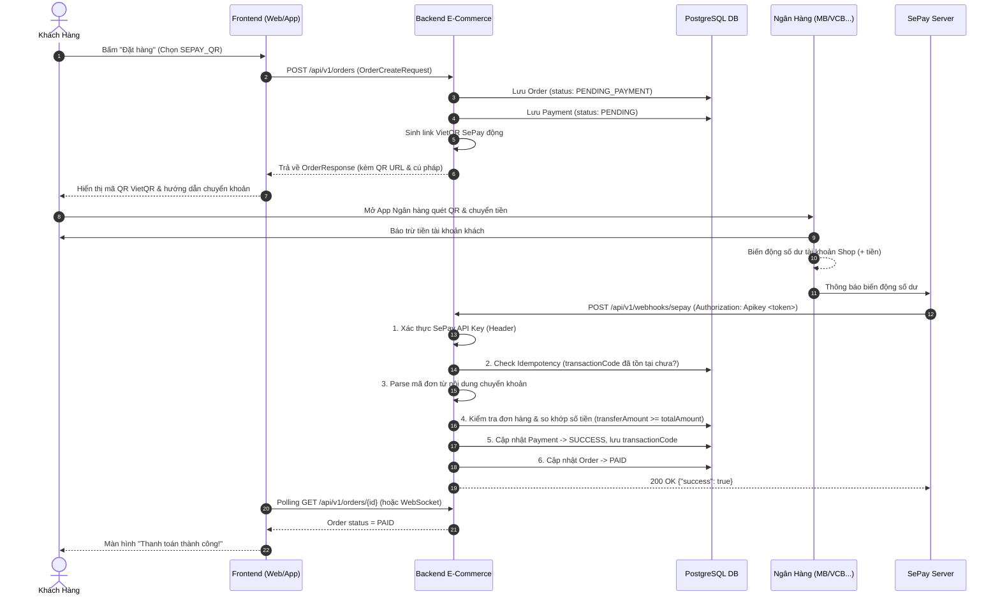

# Kế Hoạch Thiết Kế & Triển Khai Tích Hợp Cổng Thanh Toán SePay (VietQR & Webhook)

Tài liệu này mô tả chi tiết toàn bộ kiến trúc, luồng dữ liệu (Data Flow), thiết kế bảo mật và các bước lập trình cụ thể để tích hợp cổng thanh toán **SePay** vào hệ thống `backend-e-commerce`.

---

## 1. Mục Tiêu Dự Án (Goal Description)

1. **Tạo mã VietQR động**: Khi khách hàng chọn phương thức thanh toán `SEPAY_QR`, hệ thống tự động sinh link ảnh mã QR VietQR chuẩn NAPAS chứa sẵn: Số tài khoản, Ngân hàng, Số tiền chính xác và Cú pháp chuyển khoản định danh đơn hàng.
2. **Tiếp nhận Webhook biến động số dư từ SePay**: Lắng nghe thông báo khi khách chuyển khoản thành công, tự động đối soát số tiền và mã đơn hàng.
3. **Bảo mật & Tính lũy thừa (Idempotency)**: Xác thực API Key của SePay, ngăn chặn replay attacks (nhận trùng webhook) và xử lý an toàn giao dịch.
4. **Đồng bộ trạng thái**: Tự động chuyển `Payment` sang `SUCCESS` và kích hoạt `Order` từ `PENDING_PAYMENT` sang `PAID` (hoặc `CONFIRMED`).

---

## 2. Kiến Trúc & Luồng Dữ Liệu (Architecture & Flow)

### 2.1 Sơ đồ tuần tự (Sequence Diagram)



---

## 3. Các Vấn Đề Cần Thống Nhất (User Review Required)

> [!IMPORTANT]
> 1. **Cú pháp nội dung chuyển khoản (Transfer Content Syntax)**:
>    - App ngân hàng tại Việt Nam thường cắt hoặc không cho phép nhập ký tự đặc biệt như `-` hay dấu tiếng Việt.
>    - **Đề xuất**: Dùng định dạng chữ liền số: `ORD{orderId}` hoặc `{prefix}{orderId}` (Ví dụ: `ORD123` hoặc `ORD20261007001`).
> 
> 2. **Xử lý số tiền chuyển lệch**:
>    - **Trường hợp chuyển thiếu tiền**: Giữ đơn hàng ở trạng thái `PENDING_PAYMENT`, ghi log cảnh báo (không duyệt tự động).
>    - **Trường hợp chuyển thừa tiền hoặc đủ tiền**: Duyệt đơn sang `PAID`, lưu đúng số tiền khách đã chuyển thực tế vào bảng `payments`.
> 
> 3. **Xác thực bảo mật Webhook**:
>    - SePay gửi kèm header: `Authorization: Apikey <SEPAY_WEBHOOK_API_KEY>`.
>    - Endpoint Webhook bắt buộc phải được mở trong Spring Security (`permitAll`), nhưng được chặn và kiểm tra token trong Webhook Controller/Filter.

---

## 4. Chi Tiết Các Thành Phần Cần Xây Dựng (Proposed Changes)

### 4.1 Cấu hình (Configuration)

#### [MODIFY] `src/main/resources/application.yml`
Thêm khối cấu hình kết nối SePay:
```yaml
sepay:
  account-number: ${SEPAY_ACCOUNT_NUMBER:0123456789}
  bank: ${SEPAY_BANK:MBBank}
  account-name: ${SEPAY_ACCOUNT_NAME:NGUYEN VAN A}
  api-key: ${SEPAY_API_KEY:your_sepay_api_key}
  webhook-token: ${SEPAY_WEBHOOK_TOKEN:your_webhook_token}
  qr-template: ${SEPAY_QR_TEMPLATE:compact} # compact, qronly, etc.
  order-prefix: ${SEPAY_ORDER_PREFIX:ORD}
```

#### [NEW] `src/main/java/org/oplearn/project/configuration/SepayProperties.java`
Đọc cấu hình từ `application.yml`:
```java
@Component
@ConfigurationProperties(prefix = "sepay")
@Data
public class SepayProperties {
  private String accountNumber;
  private String bank;
  private String accountName;
  private String apiKey;
  private String webhookToken;
  private String qrTemplate;
  private String orderPrefix;
}
```

#### [MODIFY] `src/main/java/org/oplearn/project/constants/OpLearnConstants.java`
Cho phép endpoint webhook được truy cập công khai không cần JWT Bearer token:
```java
public static final String[] HTTP_METHOD_POST_PUBLIC = {
    "/api/v1/webhooks/sepay"
};
```

---

### 4.2 Lớp DTO (Data Transfer Objects)

#### [NEW] `src/main/java/org/oplearn/project/dto/request/SepayWebhookRequest.java`
Map đầy đủ payload webhook do SePay bắn về:
```java
@Data
@Builder
@NoArgsConstructor
@AllArgsConstructor
@JsonNaming(PropertyNamingStrategies.SnakeCaseStrategy.class)
public class SepayWebhookRequest {
  private Long id;                  // ID giao dịch trên SePay (VD: 92704)
  private String gateway;           // Tên ngân hàng (VD: Vietcombank, MBBank)
  private String transactionDate;   // Thời gian giao dịch (VD: 2026-10-07 14:02:30)
  private String accountNumber;     // Số tài khoản ngân hàng nhận
  private String code;              // Mã code thanh toán SePay (nếu có)
  private String content;           // Nội dung chuyển khoản thực tế (VD: "ORD123456")
  private String transferType;      // "in" (tiền vào) hoặc "out" (tiền ra)
  private BigDecimal transferAmount;// Số tiền giao dịch
  private BigDecimal accumulated;   // Số dư lũy kế
  private String subAccount;        // Tài khoản phụ
  private String referenceCode;     // Mã tham chiếu ngân hàng (FT24...)
  private String description;       // Chi tiết biến động
}
```

#### [NEW] `src/main/java/org/oplearn/project/dto/response/SepayWebhookResponse.java`
Trả lời cho SePay Server:
```java
@Data
@Builder
@AllArgsConstructor
@NoArgsConstructor
public class SepayWebhookResponse {
  private boolean success;
  private String message;

  public static SepayWebhookResponse ok(String message) {
    return new SepayWebhookResponse(true, message);
  }

  public static SepayWebhookResponse error(String message) {
    return new SepayWebhookResponse(false, message);
  }
}
```

#### [NEW] `src/main/java/org/oplearn/project/dto/response/PaymentQrResponse.java`
Trả về link mã QR cho Frontend hiển thị:
```java
@Data
@Builder
@NoArgsConstructor
@AllArgsConstructor
@JsonNaming(PropertyNamingStrategies.SnakeCaseStrategy.class)
public class PaymentQrResponse {
  private String qrCodeUrl;       // Link ảnh VietQR
  private String bankName;        // Tên ngân hàng
  private String accountNumber;   // Số tài khoản
  private String accountName;     // Chủ tài khoản
  private BigDecimal amount;      // Số tiền cần chuyển
  private String transferContent; // Cú pháp chuyển khoản bắt buộc
}
```

---

### 4.3 Lớp Repository

#### [MODIFY] `src/main/java/org/oplearn/project/repository/PaymentRepository.java`
Bổ sung các phương thức truy vấn cho Webhook & Idempotency:
```java
public interface PaymentRepository extends JpaRepository<Payment, Long> {
  Optional<Payment> findByIdAndIsDeletedFalse(Long id);
  Optional<Payment> findByOrderIdAndIsDeletedFalse(Long orderId);
  boolean existsByTransactionCodeAndIsDeletedFalse(String transactionCode);
  
  @Query(...)
  Page<PaymentResponse> findByStatus(@Param("status") PaymentStatus status, Pageable pageable);
}
```

---

### 4.4 Lớp Service & Logic Nghiệp Vụ

#### [NEW] `src/main/java/org/oplearn/project/service/SepayService.java` & `impl/SepayServiceImpl.java`
Nhiệm vụ:
1. **`generateQrUrl(Order order)`**:
   Tạo URL QR VietQR:
   `https://qr.sepay.vn/img?acc={STK}&bank={BANK}&amount={AMOUNT}&des={ORD123}&template=compact`
2. **`processWebhook(SepayWebhookRequest request, String authHeader)`**:
   - Bước 1: Validate `authHeader` so với `sepayProperties.getWebhookToken()`.
   - Bước 2: Kiểm tra `transferType.equalsIgnoreCase("in")`. Nếu là "out" thì bỏ qua (`return ok`).
   - Bước 3: Kiểm tra Idempotency qua `referenceCode` hoặc `request.getId()`. Nếu đã xử lý -> return `ok("Already processed")`.
   - Bước 4: Parse mã đơn hàng `orderCode` từ chuỗi `content`.
   - Bước 5: Tìm `Order` trong DB. Kiểm tra `order.status == PENDING_PAYMENT`.
   - Bước 6: Kiểm tra `request.getTransferAmount().compareTo(order.getTotalAmount()) >= 0`.
   - Bước 7: Trong Transaction:
     - Tạo hoặc cập nhật `Payment` của đơn hàng sang `PaymentStatus.SUCCESS`, lưu `transactionCode = request.getReferenceCode()`.
     - Chuyển `Order` sang `OrderStatus.PAID`.

#### [NEW] `src/main/java/org/oplearn/project/service/PaymentService.java` & `impl/PaymentServiceImpl.java`
Quản lý các nghiệp vụ của `Payment`:
- `PaymentResponse detail(Long id)`: Xem chi tiết 1 payment (kèm kiểm tra quyền User/Admin).
- `PaymentResponse getByOrderId(Long orderId)`: Lấy thông tin thanh toán theo ID đơn hàng.
- `PageResponse<PaymentResponse> findByStatus(PaymentStatus status, Pageable pageable)`: Dành cho Admin tra cứu dòng tiền.

---

### 4.5 Lớp Controller & Facade

#### [NEW] `src/main/java/org/oplearn/project/controller/SepayWebhookController.java`
Endpoint tiếp nhận Webhook:
```java
@RestController
@RequestMapping("/api/v1/webhooks")
@RequiredArgsConstructor
@Slf4j
public class SepayWebhookController {

  private final SepayService sepayService;

  @PostMapping("/sepay")
  public ResponseEntity<SepayWebhookResponse> handleSepayWebhook(
      @RequestHeader(value = "Authorization", required = false) String authorizationHeader,
      @RequestBody SepayWebhookRequest request
  ) {
    log.info("(handleSepayWebhook) received: {}", request);
    SepayWebhookResponse response = sepayService.processWebhook(request, authorizationHeader);
    return ResponseEntity.ok(response);
  }
}
```

#### [NEW] `src/main/java/org/oplearn/project/controller/PaymentController.java`
Cung cấp các API xem chi tiết:
- `GET /api/v1/payments/{id}`: Xem chi tiết thanh toán.
- `GET /api/v1/payments/order/{orderId}`: Xem thanh toán theo đơn hàng.

#### [MODIFY] `src/main/java/org/oplearn/project/facade/impl/OrderFacadeServiceImpl.java`
Khi khách tạo đơn hàng với `paymentMethod == SEPAY_QR`:
- Tạo bản ghi `Payment` với trạng thái `PENDING`.
- Gắn thêm thông tin `PaymentQrResponse` vào `OrderResponse` để Frontend hiển thị mã QR ngay trên màn hình hoàn tất đơn hàng.

---

## 5. Kế Hoạch Kiểm Thử & Xác Minh (Verification Plan)

### 5.1 Kiểm tra biên dịch
Chạy lệnh biên dịch để đảm bảo không có lỗi syntax:
```powershell
& "C:\Program Files\JetBrains\IntelliJ IDEA 2025.3.1\plugins\maven\lib\maven3\bin\mvn.cmd" test-compile
```

### 5.2 Kiểm tra tích hợp bằng Mock Webhook
1. **Tạo đơn hàng thử nghiệm**:
   - Gọi `POST /api/v1/orders` với `payment_method_id` của SePay -> Nhận được `orderCode` (VD: `ORD1001`) và trạng thái `PENDING_PAYMENT`.
2. **Giả lập SePay bắn Webhook**:
   - Gửi request `POST /api/v1/webhooks/sepay` bằng curl hoặc Postman:
     - Header: `Authorization: Apikey <your_test_token>`
     - Body:
       ```json
       {
         "id": 12345,
         "gateway": "MBBank",
         "transactionDate": "2026-10-07 15:00:00",
         "accountNumber": "0123456789",
         "content": "ORD1001",
         "transferType": "in",
         "transferAmount": 350000,
         "referenceCode": "MB.TEST.12345"
       }
       ```
3. **Kiểm tra kết quả**:
   - API trả về `200 OK {"success": true}`.
   - Gọi `GET /api/v1/orders/{id}` -> Trạng thái đơn đổi thành `PAID`.
   - Gọi `GET /api/v1/payments/order/{orderId}` -> Trạng thái payment đổi thành `SUCCESS`, `transaction_code = "MB.TEST.12345"`.
4. **Kiểm tra Idempotency (Gửi lại lần 2)**:
   - Gửi lại request trên lần 2 -> Hệ thống không xử lý lặp lại, không sinh lỗi, trả về thành công ngay lập tức.
