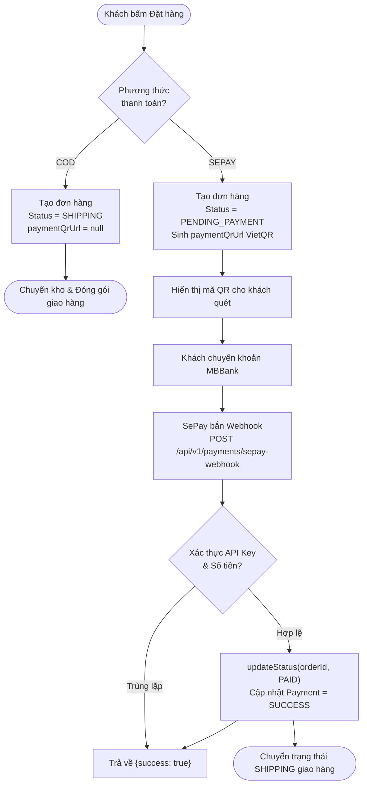

# Kế hoạch tích hợp Cổng thanh toán SePay Webhook & Hoàn thiện OrderController

Tài liệu thiết kế kỹ thuật và lộ trình triển khai tích hợp tự động hóa thanh toán VietQR ngân hàng (MBBank) qua **SePay (sepay.vn)**, phân luồng phương thức thanh toán (**COD** vs **SEPAY**) và hoàn thiện các API quản lý đơn hàng.

---

## 1. Mục tiêu (Goal Description)

1. **Phân luồng phương thức thanh toán (Payment Method Logic)**:
   - Thêm cột `payment_method_id` vào bảng `orders` và seed 2 phương thức chuẩn:
     - `COD` (Thanh toán khi nhận hàng)
     - `SEPAY` (Chuyển khoản VietQR qua SePay)
   - **Nếu chọn `COD`**:
     - Đơn hàng khởi tạo lập tức ở trạng thái **`SHIPPING`** (bỏ qua bước thanh toán online, đi thẳng vào đóng gói & vận chuyển).
     - Không sinh mã VietQR (`paymentQrUrl = null`).
   - **Nếu chọn `SEPAY`**:
     - Đơn hàng khởi tạo ở trạng thái **`PENDING_PAYMENT`**.
     - Sinh mã VietQR động (`paymentQrUrl`) để khách quét mã thanh toán.
     - Sau khi khách chuyển khoản, SePay webhook bắn về xác nhận -> chuyển sang **`PAID`**.

2. **Tích hợp SePay Webhook tự động**:
   - Khi người mua chuyển khoản quét mã VietQR vào tài khoản MBBank (`0931504117`), SePay gửi HTTP POST Webhook tới hệ thống Backend.
   - Endpoint: `POST /api/v1/payments/sepay-webhook`.
   - Xác thực API Key an toàn qua header `Authorization: Apikey <TOKEN>`.
   - Phân tích nội dung chuyển khoản để lấy mã đơn hàng (`HAZI...`), đối soát số tiền chuyển khoản với tổng tiền đơn hàng.
   - Tự động chuyển trạng thái đơn hàng từ `PENDING_PAYMENT` sang `PAID`.
   - Hỗ trợ **Idempotency** (chống xử lý trùng lặp khi SePay gửi lại nhiều lần) và trả về định dạng JSON `{"success": true}` chuẩn SePay quy định.

3. **Tự động sinh mã VietQR thanh toán**:
   - Khi tạo đơn hàng thành công hoặc xem chi tiết đơn hàng ở phương thức `SEPAY` và trạng thái `PENDING_PAYMENT`, hệ thống sinh link ảnh VietQR:
     `https://qr.sepay.vn/img?acc=0931504117&bank=MBBank&amount={TOTAL_AMOUNT}&des={ORDER_CODE}&template=compact`

4. **Hoàn thiện OrderController**:
   - Expose đầy đủ các RESTful API cho luồng mua hàng và quản trị đơn hàng:
     - `POST /api/v1/orders/preview`: Xem trước hóa đơn, tính phí vận chuyển GHTK.
     - `POST /api/v1/orders`: Đặt hàng chính thức.
     - `GET /api/v1/orders/{id}`: Chi tiết đơn hàng.
     - `GET /api/v1/orders`: Danh sách đơn hàng phân trang theo trạng thái của người dùng.
     - `PATCH /api/v1/orders/{id}/status`: Cập nhật trạng thái đơn hàng.

5. **Khắc phục lỗi tiềm ẩn về Phân quyền khi gọi từ Webhook**:
   - Phương thức `OrderFacadeServiceImpl.updateStatus(id, status)` hiện đang gọi `this.detail(id)`, bên trong lại gọi `currentUser()`. Webhook từ SePay không chứa JWT session người dùng, sẽ bị văng ngoại lệ `UserUnauthorizedException`.
   - Sử dụng `orderService.detail(id)` hoặc truy vấn trực tiếp thực thể `Order` mà không phụ thuộc vào `SecurityContextHolder`.

---

## 2. Kiến trúc & Luồng hoạt động (Workflow Diagram)



---

## 3. Những điểm cần User Review & Xác nhận (User Review Required)

> [!IMPORTANT]
> **1. Quy tắc chuyển trạng thái theo Phương thức thanh toán**:
> - **COD**: Đơn hàng tạo xong sẽ mang trạng thái **`SHIPPING`**, không tạo mã QR.
> - **SEPAY**: Đơn hàng tạo xong sẽ mang trạng thái **`PENDING_PAYMENT`**, trả về URL ảnh mã VietQR. Sau khi SePay xác nhận chuyển khoản thành công, đơn hàng tự động đổi sang **`PAID`**.

> [!TIP]
> **2. Cơ sở dữ liệu & Liquibase**:
> - Sẽ thêm changeset `029-add-payment-method-to-orders-and-seed-data.xml`:
>   + Bổ sung cột `payment_method_id` vào bảng `orders`.
>   + Seed sẵn 2 bản ghi trong bảng `payment_methods`:
>     * `name: "Thanh toán khi nhận hàng (COD)"`, `code: "COD"`
>     * `name: "Chuyển khoản SePay (VietQR)"`, `code: "SEPAY"`

> [!NOTE]
> **3. Thông tin tài khoản SePay**:
> - Bank: `MBBank` | STK: `0931504117` | Tên: `NGUYEN DUC HAI`
> - Token: `PAFDL0WEJACS6I3PITVEZSQKJZTN2QYUMCUBR5MBBVDCZN5GEDFCSNNF7OTOHRX7`
> - Secret fallback: `haziisepaysecretkey2026`

---

## 4. Chi tiết các thay đổi (Proposed Changes)

### Component 1: Database & Liquibase

#### [NEW] `029-add-payment-method-to-orders-and-seed-data.xml`
- Thư mục: `src/main/resources/db/changelog/029-add-payment-method-to-orders-and-seed-data.xml`
- Thêm cột `payment_method_id` vào `orders` (FK tới `payment_methods(id)`).
- Chèn dữ liệu mẫu cho 2 phương thức `COD` và `SEPAY`.

#### [MODIFY] `master.xml`
- Include file `029-add-payment-method-to-orders-and-seed-data.xml`.

---

### Component 2: Entities & DTOs

#### [MODIFY] `Order.java`
- Thêm trường:
  ```java
  @Column(name = "payment_method_id")
  private Long paymentMethodId;
  ```

#### [NEW] `Payment.java` & `PaymentRepository.java`
- Map vào bảng `payments` đã có sẵn trong Liquibase changeset 014 để lưu vết lịch sử giao dịch (amount, status, transaction_code).

#### [MODIFY] `OrderRequest.java`
- Thêm trường `private Long paymentMethodId;` (với `@NotNull(message = "order.payment_method_id.not_null")`).

#### [MODIFY] `OrderResponse.java` & `OrderPreviewResponse.java`
- Thêm các trường:
  ```java
  private Long paymentMethodId;
  private String paymentMethodName;
  private String paymentMethodCode;
  private String paymentQrUrl;
  ```

#### [NEW] `SepayWebhookRequest.java` & `SepayWebhookResponse.java`
- Khắc phục xung đột đặt tên JSON snake_case / camelCase và đảm bảo phản hồi đúng format `{"success": true}` mà SePay yêu cầu.

---

### Component 3: Cấu hình SePay & Bảo mật

#### [NEW] `SepayProperties.java` & [MODIFY] `application.yml`
- Cấu hình API key, STK MBBank, ngân hàng, format template QR.

#### [MODIFY] `OpLearnConstants.java`
- Thêm `"/api/v1/payments/sepay-webhook"` vào `HTTP_METHOD_POST_PUBLIC`.

---

### Component 4: Logic Nghiệp vụ (`PaymentService` & `OrderFacadeServiceImpl`)

#### [NEW] `PaymentService.java` & `PaymentServiceImpl.java`
- Chức năng:
  1. `generatePaymentQrUrl(String orderCode, BigDecimal amount)`: Sinh URL VietQR SePay dạng `https://qr.sepay.vn/img?...`.
  2. `processSepayWebhook(String authHeader, SepayWebhookRequest request)`: Xác thực token, kiểm tra số tiền, gọi cập nhật trạng thái đơn sang `PAID`, lưu transaction code vào bảng `payments`.

#### [MODIFY] `OrderFacadeServiceImpl.java`
- Trong `preView`: Lấy thông tin `paymentMethod` gắn vào preview.
- Trong `create`:
  - Lấy `paymentMethod` theo `request.getPaymentMethodId()`.
  - Phân nhánh:
    + Nếu là `COD`: Set order status = `OrderStatus.SHIPPING`. `paymentQrUrl = null`.
    + Nếu là `SEPAY`: Set order status = `OrderStatus.PENDING_PAYMENT`. Tự động sinh `paymentQrUrl`.
  - Lưu `Payment` record trạng thái `PENDING`.
- Trong `updateStatus`: Dùng `orderService.detail(id)` để bypass auth context, hỗ trợ `case PAID ->` hoàn tất thanh toán.

---

### Component 5: REST Controllers

#### [NEW] `PaymentController.java`
- Endpoints:
  - `POST /api/v1/payments/sepay-webhook`: Nhận webhook từ SePay.
  - `GET /api/v1/payments/orders/{id}/qr-code`: Lấy URL mã QR thanh toán.

#### [NEW] `OrderController.java`
- Endpoints:
  - `POST /api/v1/orders/preview`
  - `POST /api/v1/orders`
  - `GET /api/v1/orders/{id}`
  - `GET /api/v1/orders`
  - `PATCH /api/v1/orders/{id}/status`

---

## 5. Kế hoạch Kiểm thử & Xác minh (Verification Plan)

### 1. Compile Check
- Biên dịch toàn bộ bằng Maven:
  ```powershell
  & "C:\Program Files\JetBrains\IntelliJ IDEA 2025.3.1\plugins\maven\lib\maven3\bin\mvn.cmd" test-compile
  ```

### 2. Luồng kiểm thử nghiệp vụ
1. **Test Đơn COD**:
   - Gọi `POST /api/v1/orders` với `paymentMethodId` của COD.
   - Kết quả: `status = SHIPPING`, `paymentQrUrl = null`.
2. **Test Đơn SEPAY**:
   - Gọi `POST /api/v1/orders` với `paymentMethodId` của SEPAY.
   - Kết quả: `status = PENDING_PAYMENT`, `paymentQrUrl` chứa link ảnh QR VietQR có đúng STK và mã đơn `HAZI...`.
3. **Test Webhook SePay**:
   - Gửi webhook giả lập với header `Authorization: Apikey [TOKEN]` và nội dung chứa mã đơn hàng `HAZI...`.
   - Kết quả: Trả về HTTP 200 `{"success": true}`, trạng thái đơn đổi thành `PAID`.
   - Gửi lại webhook lần 2: Đảm bảo vẫn trả về `{"success": true}` (Idempotency).
